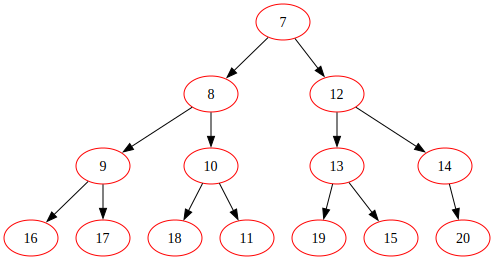
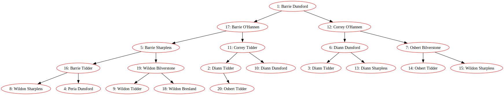

# collection-ext

`collection-ext` is a Java library offering enhanced and extended data
structures and algorithms beyond the standard Java Collection framework.

### Disclaimer:

This project is a pure education project and **should not be used for anything
real**. At least at this point.

### Examples:

#### Heap

There are two explicit implemenation of Heap - MinHeap and MaxHeap which follows
the min and max heap properties as the name suggests.

For instantiating a min heap and pushing first 20 natural numbers:

```java

Heap<Integer> heap = new MinHeap<>();
for (int i = 1; i <= 20; i++) {
  heap.push(i);
}

// Pop first 6 numbers and get a svg dump of current state
for (int i = 0; i < 6; i++) {
  System.out.println(heap.pop());
}

// To take a svg dump of the current state of the tree
String svg = heap.toSvg();

```



<br>

To work with custom objects, the object needs to be `Comparable`, or provide a
custom `Comparator` when instantiating the heap.

```java
static class Employee {
    private final int id;
    private final String firstName;
    private final String lastNam

    public Employee(int id, String firstName, String lastName) {
      this.id = id;
      this.firstName = firstName;
      this.lastName = lastName;
    }

    public String getFirstName() {
      return firstName;
    }

    public String getLastName() {
      return lastName;
    }

    @Override
    public String toString() {
      return String.format("%d: %s %s", id, firstName, lastName);
    }
}


private static void createHeapForCustomComparator() {
      // Generate a Heap of 10 employees
      Heap<Employee> heap = new MinHeap<>(
          Comparator.comparing(Employee::getFirstName).thenComparing(Employee::getLastName));

        // list of random names generated using mockaroo.com
        String[] firstNames =
            new String[] {"Peria", "Osbert", "Barrie", "Correy", "Wildon", "Diann", "Lesli"};

        String[] lastNames =
            new String[] {"Bresland", "Bilverstone", "Sharpless", "Dunsford", "Tidder", "O'Hannen", "Dowry"};

        Random random = new Random();

        for (int i = 1; i <= 20; i++) {
            int firstNameIndex = random.nextInt(firstNames.length - 1);
            int lastNameIndex = random.nextInt(firstNames.length - 1);

            Employee employee =
                new Employee(i, firstNames[firstNameIndex], lastNames[lastNameIndex]);
            heap.push(employee);

        }

        String svg = heap.toSvg();

        try (BufferedWriter bw = new BufferedWriter(
            new FileWriter(new File("./examples/min_heap_employees.svg")))) {
            bw.write(svg);
        } catch (IOException ex) {
            System.err.printf("ERROR: Error when dumping svg to file.. - %s\n", ex.getMessage());
        }
    }

```



### License

This Project is under MIT LICENSE, a copy of which can be found [here](LICENSE).
